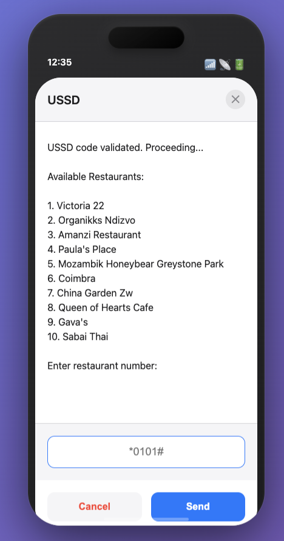

# USSD-Based Food Delivery System

<div align="center">
  
  <br>
  <em>iPhone 16-styled mobile interface for USSD food delivery</em>
</div>

A C++ implementation of a food delivery system that operates without internet access, using USSD (Unstructured Supplementary Service Data) technology to serve regions with limited connectivity.

## 📋 Table of Contents

- [🍽️ Overview](#-overview)
- [🚀 Features](#-features)
- [🏗️ System Architecture](#️-system-architecture)
- [🛠️ Object-Oriented Programming Concepts](#️-object-oriented-programming-concepts)
- [📋 Prerequisites](#-prerequisites)
- [🔧 Building and Running](#-building-and-running)
- [🎯 Usage](#-usage)
- [🎬 Demo](#-demo)
- [📊 System Architecture Flow](#-system-architecture-flow)
- [🏪 Featured Restaurants](#-featured-restaurants)
- [💳 Payment Integration](#-payment-integration)
- [🔒 Security Features](#-security-features)
- [📁 Project Structure](#-project-structure)
- [🌍 Real-World Impact](#-real-world-impact)
- [🔮 Future Enhancements](#-future-enhancements)
- [🛠️ Technical Implementation Details](#️-technical-implementation-details)
- [📱 Mobile Integration](#-mobile-integration)
- [👨‍💻 Author](#-author)
- [📄 License](#-license)
- [🤝 Contributing](#-contributing)
- [📚 References](#-references)

## 🍽️ Overview

This project addresses the digital divide by bringing modern food delivery convenience to underserved regions without reliable internet access. The system allows users to browse restaurant menus, place orders, and make payments through a simple USSD interface, making food delivery accessible to communities previously left behind by digital advancements.

## 🚀 Features

- **📱 Mobile Web Interface**: Beautiful iPhone 16-styled UI for interactive demos
- **Internet-Free Operation**: Uses USSD technology for connectivity
- **Multiple Payment Methods**: Supports Visa Card, EcoCash, and Payment on Delivery
- **Restaurant Management**: Easy addition and management of restaurants and menu items
- **Order Tracking**: Real-time order status updates
- **Object-Oriented Design**: Clean, maintainable C++ architecture
- **Local Integration**: Designed for Zimbabwe with EcoCash payment support
- **Dual Interface**: Both command-line (C++) and web interface (HTML/CSS/JS)

## 🏗️ System Architecture

The system is built using four core classes:

- **`MenuItem`**: Encapsulates menu item properties (name, price)
- **`Restaurant`**: Manages restaurant data and menu items
- **`Order`**: Handles order placement, processing, and tracking
- **`USSDSystem`**: Main controller for user interaction and system coordination

## 🛠️ Object-Oriented Programming Concepts

### Implemented OOP Principles:
- **Classes and Objects**: Modular design with clear separation of concerns
- **Inheritance**: Base and derived classes for extensibility
- **Function Overloading**: Multiple order placement methods
- **Function Overriding**: Customized behavior for different restaurant types

### Optimization Techniques:
- **Inline Functions**: Performance optimization for frequently accessed methods
- **Function Templates**: Dynamic price comparisons for sorted menu display
- **STL Vectors**: Dynamic memory management for scalable data handling
- **Friend Functions**: Enhanced output formatting and data access

## 📋 Prerequisites

- C++11 or later compiler
- Make utility (for building with makefile)

## 🔧 Building and Running

### Option 1: Web Interface (Recommended for Demo) 📱

Experience the system with a beautiful iPhone 16-styled mobile interface:

```bash
# Simply open in your browser
open index.html

# Or use a local server
python3 -m http.server 8000
# Then navigate to: http://localhost:8000
```

> 📖 **Full Guide**: See [WEB_INTERFACE.md](WEB_INTERFACE.md) for complete web interface documentation.

### Option 2: Command Line (C++ Backend)

#### Using Makefile:
```bash
# Compile the project
make

# Run the executable
./food_delivery

# Clean build files
make clean
```

#### Manual Compilation:
```bash
g++ -std=c++11 -Wall -Werror -o food_delivery main.cpp MenuItem.cpp Restaurant.cpp Order.cpp USSDSystem.cpp
```

## 🎯 Usage

1. **Run the program**: Execute the compiled binary
2. **Select Restaurant**: Choose from available restaurants in Harare
3. **Browse Menu**: View available items and prices
4. **Place Order**: Select items and quantities
5. **Choose Payment**: Select from Visa Card, EcoCash, or Payment on Delivery
6. **Track Order**: Monitor order status from placement to delivery

## 🎬 Demo

### Quick Start Demo
```bash
# Clone and build the project
git clone <repository-url>
cd food-delivery-system
make

# Run the demo
./food_delivery
```

> 📖 **Detailed Demo Guide**: See [demo.md](demo.md) for a complete walkthrough with sample interactions and all payment methods.

### Sample User Interaction Flow

**Step 1: USSD Code Entry**
```
Enter USSD code to start (*0101#): *0101#

USSD code validated. Proceeding...

Available Restaurants:
1. Victoria 22
2. Organikks Ndizvo
3. Amanzi Restaurant
4. Paula's Place
5. Mozambik Honeybear Greystone Park
6. Coimbra
7. China Garden Zw
8. Queen of Hearts Cafe
9. Gava's
10. Sabai Thai

Enter restaurant number: 1
```

**Step 2: Menu Browsing**
```
Menu for Victoria 22:
1. Prawn and hake madras curry with turmeric rice - $20
2. Seafood linguine with roasted tomato and basil sauce - $17.5
3. Red wine braised oxtail with parmesan mash - $17.5
4. De-boned stuffed quails with a bone marrow jus - $20
5. Sweet chili pork fillet wrapped in bacon - $17.5
6. Eggplant tower, tomato passata, and lentil ragù - $12.5
7. 4 Cheese Penne - $17.5

Enter menu item number (0 to finish): 1
```

**Step 3: Order Summary & Payment Selection**
```
Order contains:
- Prawn and hake madras curry with turmeric rice ($20)
Total price: $20.00

Select payment method:
1. Visa Card
2. EcoCash  
3. Payment on Delivery

Enter your choice: 2
```

**Step 4: Order Confirmation**
```
=== Payment Processing ===
Please enter your EcoCash PIN: ****

✅ Payment successful!
✅ Order confirmed and being prepared
🚚 Order dispatched and on the way
🏠 Order delivered successfully!

Thank you for using USSD Food Delivery!
```

## 📊 System Architecture Flow


*This flowchart illustrates the complete user journey from USSD access to order delivery, showing the seamless interaction between system components.*

## 🏪 Featured Restaurants

The system includes 10 popular restaurants in Harare:

- Victoria 22 (Fine Dining)
- Organikks Ndizvo (Thai & International)
- Amanzi Restaurant (Contemporary African)
- Paula's Place (Seafood & Grills)
- Mozambik Honeybear (Portuguese & African)
- Coimbra (Portuguese Cuisine)
- China Garden Zw (Chinese)
- Queen of Hearts Cafe (International)
- Gava's (Traditional Zimbabwean)
- Sabai Thai (Thai Cuisine)

## 💳 Payment Integration

- **Visa Card**: Traditional card payments
- **EcoCash**: Mobile money integration for Zimbabwe
- **Payment on Delivery**: Cash payment upon delivery

## 🔒 Security Features

- Input validation and error handling
- Limited retry attempts for security
- Exception handling for robust operation

## 📁 Project Structure

```
food-delivery-system/
├── Backend (C++)
│   ├── main.cpp              # Main program entry point
│   ├── makefile              # Build configuration
│   ├── MenuItem.h/.cpp       # Menu item class implementation
│   ├── Order.h/.cpp          # Order processing and tracking
│   ├── Restaurant.h/.cpp     # Restaurant management
│   └── USSDSystem.h/.cpp     # USSD interface controller
├── Frontend (Web)
│   ├── index.html            # iPhone 16-styled mobile UI
│   ├── styles.css            # Modern iOS styling
│   └── app.js                # USSD logic simulation
├── Documentation
│   ├── README.md             # Main documentation (this file)
│   ├── WEB_INTERFACE.md      # Web interface guide
│   ├── demo.md               # Interactive demo guide
│   └── Report.md             # Detailed technical report
└── Build Files
    ├── food_delivery         # Compiled executable
    └── *.o                   # Object files
```

## 🌍 Real-World Impact

This system demonstrates how technology can bridge the digital divide by:
- Providing food delivery services to underserved communities
- Integrating with local payment systems (EcoCash)
- Using existing mobile infrastructure (USSD)
- Promoting financial inclusion in developing regions

## 🔮 Future Enhancements

- Database integration for user management
- Real-time order tracking system
- Integration with local delivery networks
- Multi-language support
- Restaurant owner dashboard
- Analytics and reporting features
- SMS notifications for order updates
- GPS tracking for delivery routes
- Loyalty program integration
- Multi-currency support for regional expansion

## 🛠️ Technical Implementation Details

### Key Code Examples

**Creating a Menu Item:**
```cpp
MenuItem item("Prawn and hake madras curry", 20.00);
```

**Adding Items to Restaurant:**
```cpp
Restaurant restaurant("Victoria 22");
restaurant.addMenuItem(MenuItem("Seafood linguine", 17.50));
```

**Order Processing:**
```cpp
Order order;
order.addItem(item);
order.calculateTotal();
```

### Performance Optimizations

- **Inline Functions**: Critical getter methods for minimal overhead
- **STL Vectors**: Dynamic memory management for scalability
- **Template Functions**: Type-safe comparisons for price sorting
- **Exception Handling**: Robust error management for production use

## 📱 Mobile Integration

The system is designed to work seamlessly with:
- **USSD Short Codes**: Easy access via mobile keypad
- **EcoCash Integration**: Zimbabwe's leading mobile money platform
- **SMS Notifications**: Order updates via text messages
- **Feature Phone Support**: Works on basic mobile devices

## 👨‍💻 Author

**Calvin Gutsa**
- Version: 1.0
- Created: October 5, 2022
- Focus: Bridging digital divide through innovative USSD solutions

## 📄 License

This project is part of an academic demonstration of object-oriented programming principles and real-world problem solving.

## 🤝 Contributing

This project serves as an educational example of applying OOP concepts to solve real-world challenges. Contributions that enhance the system's functionality or documentation are welcome.

## 📚 References

- Mobile Money Research and Development in Zimbabwe
- USSD Technology Implementation
- Object-Oriented Programming Best Practices
- Financial Inclusion in Developing Markets

---

*Built with ❤️ to serve communities beyond the digital divide*
